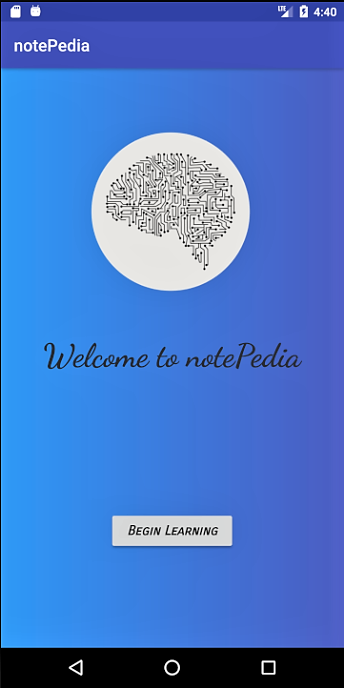
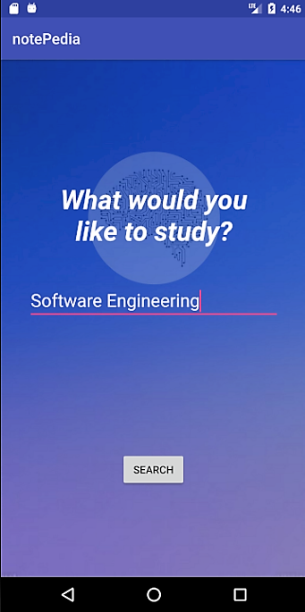
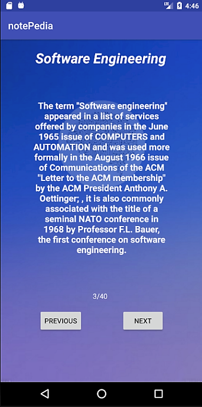
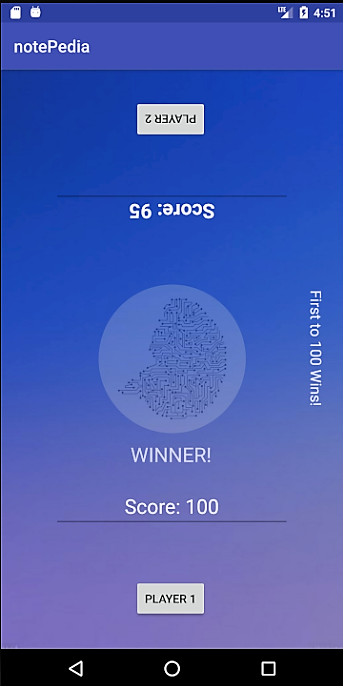

# notePedia
notePedia was created at {eHacks} 2018 by Aaron Hargrove, Nathan Layfield, and Michael Bracey where it won the "Best Mobile App" category. UI designed for and emulated on Google's Pixel 2 XL. Please excuse the low number of commits, as this project was developed on a private git server that Github does not support project migration from. Git structure was: master <- develop <- [use case branches].

### Description:
notePedia is an application that creates fact flashcards based on a user's search, utilizing WikiPedia for information. The app starts by preloading the search bar with a random topic. This allows users to learn about topics they have never heard of. From there, the user may enter their own search or use the default one given to them. After the user hits "search,"  notePedia makes a Google search, acting as an automatic spell check. It then goes to the WikiPedia page associated with the search and summarizes the information using the SMMRY api. The information is then split up into up to 40 cards the user can read through.

### My Role:
My part in this project dealt with all UI and most of the search functionality. For the search feature, I was in charge of taking the user's input and preparing it to search for the WikiPedia page. After we had the desired page, my job was to use the SMMRY api to summarize the information, get the JSON data, process that data, handle any errors, and then display the results to the user.

### What's Next:
The next step for this project is to build our own data summarizer. The SMMRY api only allows 100 free requests per day per api key, which would cause problems if we ever wanted to release notePedia on the Google Play Store.

### To Run:
To run the program, it may be emulated on a device through Android Studio, or the APK may be downloaded onto an android device. 
##### To download apk from android device:
- Ensure that apps from unknown sources are allowed (typically in security settings.)
- In notePedia -> APK, click on the apk file and download. 
- Once downloaded, select “Install.”
##### To download apk from PC:
- Ensure that apps from unknown sources are allowed (typically in security settings.)
- In notePedia -> APK, click on the apk file and download to a location on the PC that is easy to find.
- Plug the android device into the computer and select “Media Device” if it asks what you would like to do with the device.
- Copy the APK file on the PC onto the android device in the downloads folder.
- Click the file on the Android device and select “Install.”

### Screenshots:
   
